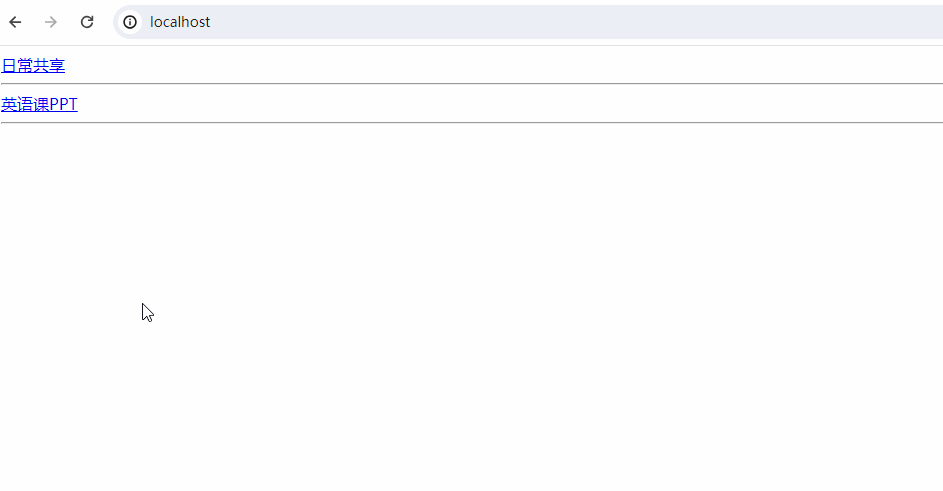

# LightFileServer

a light file server by python flask

## 前言

借助```Python Flask```实现的轻量型的文件服务器，仅支持下载暂不支持上传。

## 使用方法

1. 安装并配置好Python、Pip环境
2. 安装对应库：```pip install -r requirements.txt```
3. 修改配置文件```settings.json```，设置要开放的目录、端口等
    ```json
    {
        "ip": "0.0.0.0",  // 服务运行的ip地址
        "port": "80",     // 服务开放的端口
        "folders": {      // 要共享的文件夹
            "日常共享": "F:/LetMeFly/文件/SharedFolder",
            "英语课PPT": "F:/LetMeFly/文件/EnglishPPT"
            // "name": "path"
        }
    }
    ```
4. 开放对应端口：请保证配置文件中的端口可以被其他主机访问
5. 运行服务：```python server.py```

这样，在```settings.json > folders```中的所有```path```及其子目录中的文件都能被```settings.json > ip```的```settings.json > port```端口访问到。

## 使用效果

若路径配置错误：

```
CONFIG error! '英语课PPT' -> 'F:/LetMeFly/文件/EnglishPPT' not exists
```

若配置正确：



**大道至简，返璞归真。**

## 关于Windows

启动服务可以运行```docs/windows/fileserver.bat```，关闭服务可以运行```docs/windows/fileserver-stop.bat```。

若想要开机自启可以为```docs/windows/fileserver.bat```创建一个快捷方式并移动到“开机自启目录”下。关于开机自启目录，可以```Win + R -> shell:startup -> enter```打开。

在写```fileserver-stop.bat```的时候[这篇文章](https://www.jb51.net/article/29323.htm)帮助了我很多。

## 后记

这段代码是怎么来的呢？本蒟蒻参与了一门需要自己制作PPT并在课堂上展示的英语课。英语老师为防止电脑中病毒仅允许使用格式化后的U盘往电脑上拷贝PPT。

BUPT不是个大局域网么，英语教室的主机是有连接这个局域网的，因此在我实验室主机上开个```文件下载服务```就不需要格式化U盘来拷贝PPT了。

然后就有了这些代码。
